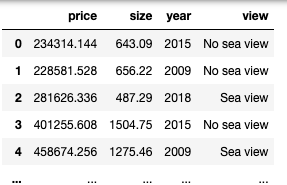
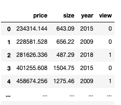
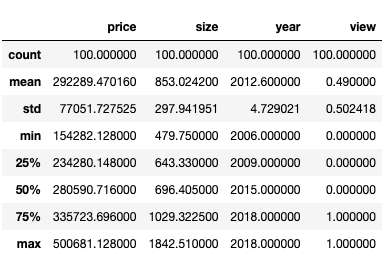
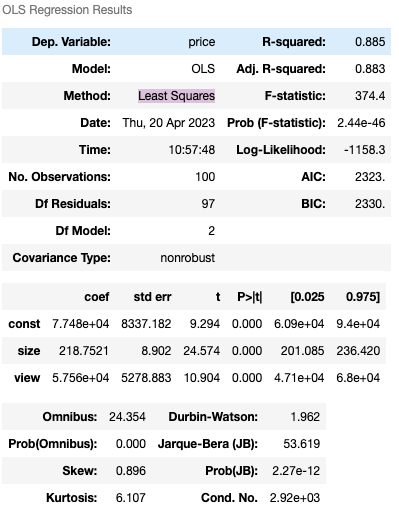
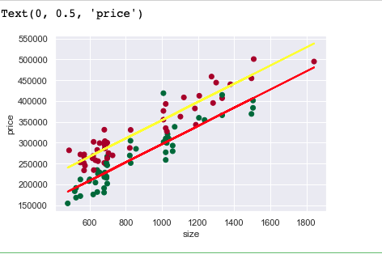
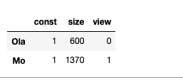
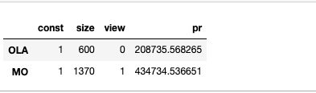

# Multiple linear regression and adjusted R-squared

#### Import the relevant libraries


```
import numpy as np
import pandas as pd
import matplotlib.pyplot as plt
import statsmodels.api as sm
import seaborn
seaborn.set()

```

#### Load the data

```data = pd.read_csv('29588130-real-estate-price-size-year-view.csv')  ```

#### Create your first multiple regression

```

dp = data.copy()

dp['view'] =dp['view'].map({'No sea view':0,'Sea view':1})

dp
```




#### Create your first multiple regression


```

dp = data.copy()
dp['view'] =dp['view'].map({'No sea view':0,'Sea view':1})

```


```dp.describe() ```



 Mutiple Linear regression 
```
y = b0 + b1x1 + b2x2 +......+ e 

 y = dependent variable
 b= coeff of independent variable
 x= independent variable 
 ```

```
y= dp['price']
x1= dp[['size','view']]
```
Using Least Squares	 from  statsmodels

```
x = sm.add_constant(x1)
results= sm.OLS(y,x).fit()
results.summary()
```



Plotting scatter graph ans showing the line of intercpet 

````
plt.scatter(data['size'],y,c=dp['view'],cmap='RdYlGn_r')

y_no = 7.748e+04 + 218.7521 * data['size']

y_yes = 5.756e+04 +7.748e+04 + 218.7521 * data['size'] 

# y_d = 0.0017 * data['SAT']+ 0.275

fig = plt.plot(data['size'],y_no ,lw=2,c='red')
fig = plt.plot(data['size'],y_yes ,lw=2,c='yellow')
# fig = plt.plot(data['SAT'],y_d ,lw=2,c='blue')

plt.xlabel('size')
plt.ylabel('price')
plt.show()


````



Let predict the price of an apartment based on size and view 


```
value = pd.DataFrame({'const':1,'size':[600,1370],'view':[0,1]})
value = value[['const','size','view']]
value.rename(index={0:'Ola',1:'Mo'})
```



Now predit based on the result

``` 
prediction = results.predict(value)
prr = pd.DataFrame({'pr':pr})
joined = value.join(prr)
joined.rename(index={0:'OLA',1:'MO'})

```

